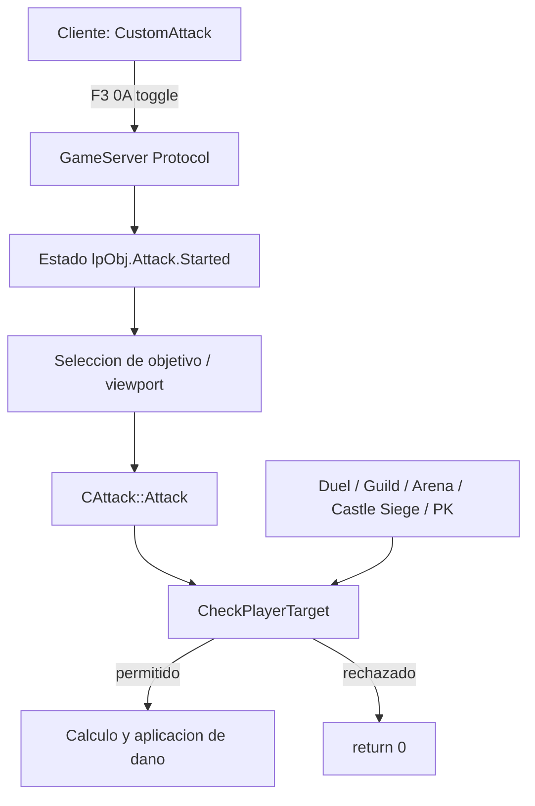

# Auditoria tecnica de Ctrl PVP

Fecha: 2026-09-14
Fuente auditada: `D:\Plugin\Source`

## 1. Resumen ejecutivo

No existe una funcion o hook identificado literalmente como `CtrlPvp` o `ControlPvp`. Tampoco se encontro una lectura de teclado (`GetAsyncKeyState`, `GetKeyState`, `WM_KEY*`, `WndProc` o `SetWindowsHook*`) asociada al PvP.

La funcionalidad se comporta como una cadena cliente-servidor:

## 2. Flujo identificado

### 2.1 Cliente

Archivo: `Source/Main/Main/Attack.cpp`

- `AutoAttackToggle()` comprueba el estado de la interfaz y envia `PMSG_CUSTOM_ATTACK_TOGGLE_SEND`.
- El paquete usa cabecera `0xF3`, subcodigo `0x0A`.
- `GCCustomAttackStatusRecv()` actualiza `CustomAttack`, detiene al personaje y limpia el estado de ataque cuando el servidor responde con `Started != 0`.
- Esta capa controla automatizacion, no la autorizacion PvP.

### 2.2 Servidor: entrada de ataque

Archivo: `Source/Emulator/GameServer/Attack.cpp`

`CAttack::Attack()` realiza validaciones generales antes de aplicar dano:

- atacante y objetivo conectados;
- mismo mapa y no teleportando;
- atributos del mapa;
- objetivo vivo, jugando y no NPC;
- restricciones de monstruos, invocaciones y eventos;
- `CheckPlayerTarget()` para jugador contra jugador;
- validacion de skill, inmunidades y calculo de dano;
- aplicacion de vida/SD y efectos posteriores.

El ataque normal y los ataques de skill convergen en esta funcion antes de modificar vida.

### 2.3 Guard central PvP

Funcion: `CAttack::CheckPlayerTarget(LPOBJ lpObj,LPOBJ lpTarget)`.

Reglas observadas, en orden:

1. Solo aplica a dos objetos `OBJECT_USER`; otros tipos pasan.
2. `gScriptLoader->OnCheckUserTarget()` puede rechazar el objetivo.
3. Administradores no pueden ser atacados.
4. Puede bloquear miembros de party cuando `m_PartyDisableKillBetweenMembers` esta activo.
5. Puede bloquear miembros de party si el atacante tiene helper activo.
6. Rivalidad de union puede permitir PvP en mapas PK.
7. Miembros de la misma guild no pueden atacarse durante una guerra activa.
8. La guerra de guild y `m_GuildWarAttackEnable` alteran el resultado.
9. Custom Arena delega en `gCustomArena->CheckPlayerTarget()`.
10. Devil Square y Blood Castle bloquean PvP.
11. Chaos Castle permite PvP solo durante `CC_STATE_START`.
12. Castle Siege decide por `CastleJoinSide` y `m_CastleSiegeDamageRate2`.
13. Kanturu 3 bloquea PvP.
14. Illusion Temple delega en `gIllusionTemple->CheckPlayerTarget()`.
15. Personajes de nivel <= 5 no pueden atacar ni ser atacados.
16. Mapas no-PK bloquean PvP.
17. El resto permite el objetivo.

## 3. Rutas relacionadas

### Alta prioridad

- `Source/Emulator/GameServer/Attack.cpp`
  - `CAttack::Attack`
  - `CAttack::CheckPlayerTarget`
  - `CAttack::MissCheckPvP`
  - calculo de dano PvP y aplicacion de vida/SD.
- `Source/Emulator/GameServer/ObjectManager.cpp`
  - `ObjectStateAttackProc()` llama a `gAttack->Attack()` para ataques y skills.
  - Debe verificarse que no exista una ruta que aplique dano sin pasar por `CheckPlayerTarget`.
- `Source/Emulator/GameServer/DarkSpirit.cpp`
  - El Dark Spirit tambien llama al sistema de ataque y debe probarse como atacante indirecto.
- `Source/Emulator/GameServer/SkillManager.cpp`
  - Las skills deben conservar el mismo guard PvP.
- `Source/Emulator/GameServer/CustomAttack.cpp`
  - Automatiza seleccion/ataque y tiene modos online/offline; no debe confiarse en el cliente para autorizar PvP.

### Contexto de reglas

- `Duel.cpp`: `CheckDuel()` solo considera duelo valido si ambos `DuelUser` se apuntan mutuamente.
- `Guild.cpp`: relaciones y guerras de guild.
- `CustomArena.cpp`: reglas de arenas.
- `CastleSiege*.cpp`: reglas de Castle Siege.
- `MapManager.cpp`: mapas PK/no-PK.
- `ServerInfo.cpp`: carga de switches de dano, guerra y CustomAttack.
- `Protocol.cpp` y `JSProtocol.cpp`: entrada de paquetes y cierre de CustomAttack.

## 4. Hallazgos y riesgos

### H-01 - Alto: no hay un guard unificado visible para todas las rutas

`CheckPlayerTarget()` es el guard central de `CAttack::Attack`, pero existen atacantes y flujos paralelos: Dark Spirit, skills, ataques custom, monstruos controlados y sistemas de eventos. La auditoria estatica no demuestra que todos los caminos converjan siempre antes de aplicar dano.

Impacto: un cambio futuro en una ruta paralela puede crear un bypass PvP.

Recomendacion: mantener una funcion unica de autorizacion, por ejemplo `CanAttackTarget()`, y llamarla inmediatamente antes de cualquier aplicacion de dano, no solo al seleccionar objetivo.

### H-02 - Alto: la autorizacion depende de muchas excepciones ordenadas

`CheckPlayerTarget()` mezcla party, union rival, guild war, arenas, eventos y mapas. El orden importa: una regla posterior puede no ejecutarse por un `return` temprano.

Impacto: cambios de configuracion pueden tener resultados distintos segun mapa, guild o duelo.

Recomendacion: convertir las reglas en una matriz explicita de contexto y conservar pruebas por cada prioridad.

### H-03 - Alto: el cliente no debe ser la autoridad de Ctrl PvP

`CustomAttack` envia un toggle, pero cualquier bloqueo PvP debe ocurrir en el servidor. El cliente puede ocultar la interfaz o detener la automatizacion, pero no puede garantizar que un ataque no se procese.

### H-04 - Medio: duelo y guerra tienen semanticas distintas

`Duel::CheckDuel()` requiere reciprocidad de `DuelUser`; `Guild::CheckWar()` y las reglas de mapa usan estados diferentes. No deben sustituirse entre si ni reducirse a una unica comprobacion booleana sin conservar el contexto.

### H-05 - Medio: ataques indirectos requieren pruebas separadas

Dark Spirit, summons y ataques automaticos pueden resolver un objetivo distinto del seleccionado inicialmente. La funcion normal incluso normaliza `SummonIndex` y `SummonTargetIndex`; esto debe quedar cubierto en pruebas.

### H-06 - Medio: no se encontro la tecla Ctrl en esta source

El nombre "Ctrl PVP" puede referirse a una convencion del cliente o a una regla de ataque, no a una tecla implementada aqui. Para encontrar la tecla real hay que auditar el cliente externo o capturar el opcode generado al pulsarla.

## 5. Conclusiones

- El candidato correcto para una implementacion de AutoCtrl server-side es `CAttack::CheckPlayerTarget`.
- `CustomAttack` es automatizacion, no control de permisos PvP.
- No se debe modificar primero `PacketManager`; su responsabilidad es cifrado/descifrado, no reglas de combate.
- No se debe confiar en `PMSG_CUSTOM_ATTACK_TOGGLE_SEND` para bloquear daño.
- Antes de escribir un hook o plugin, hay que definir la politica exacta: mapas, duelos, guild wars, party, PK y ataques indirectos.
